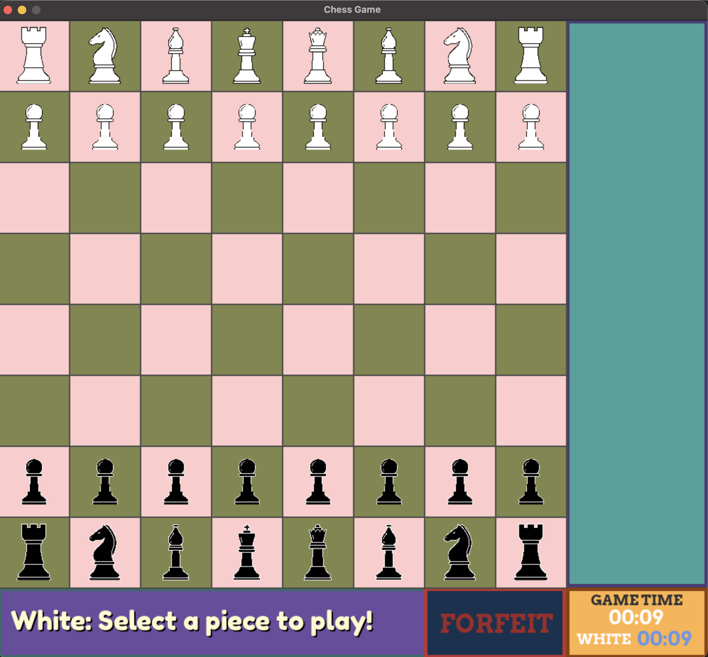
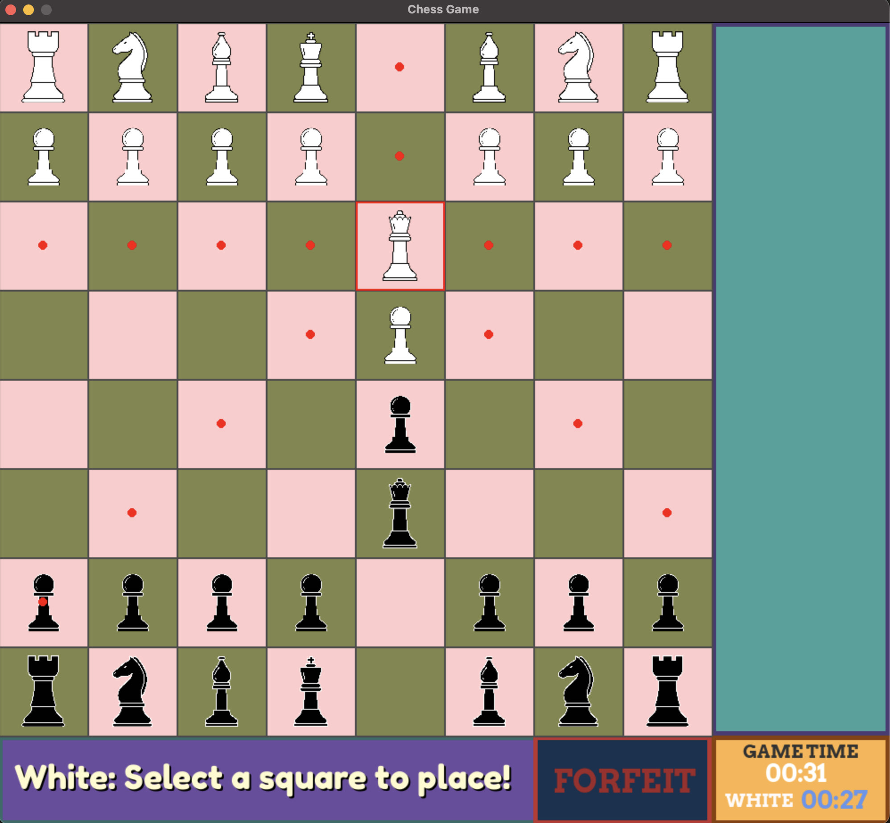
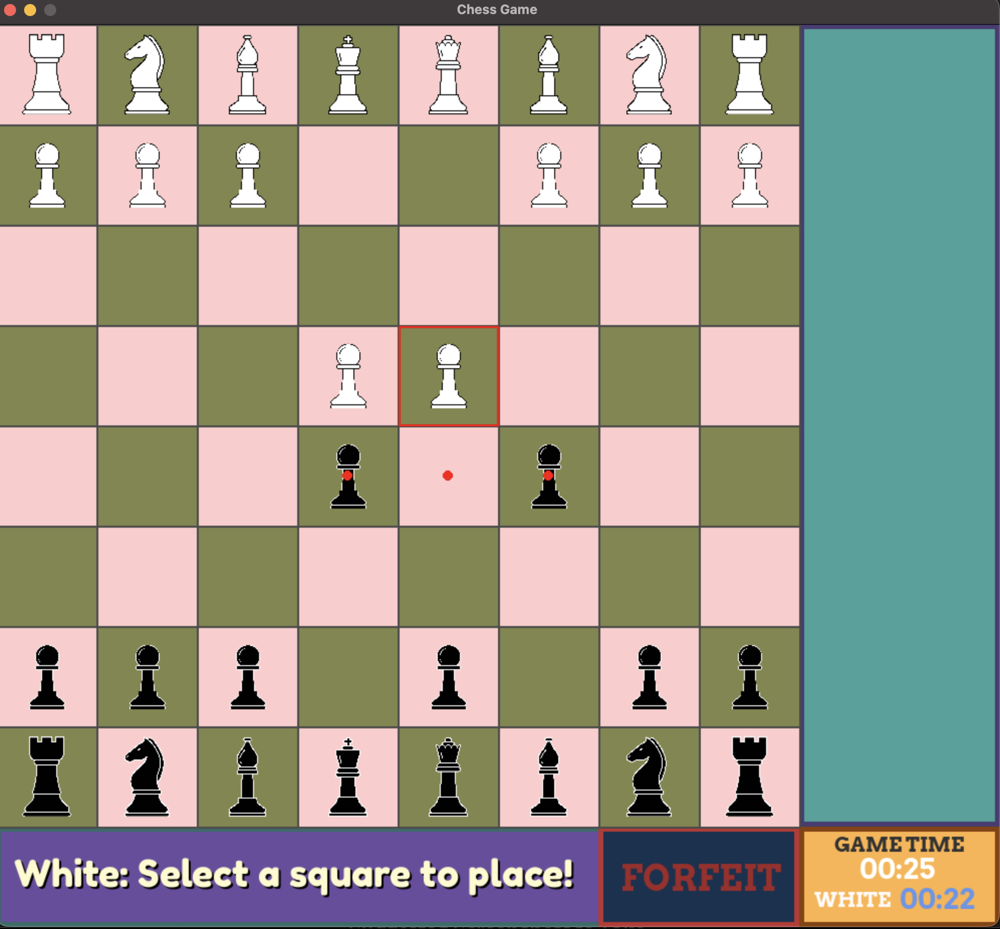

# Two-Player Chess Game



A functional chess game built with Python and Pygame featuring a turn-based clock system and a forfeit button.

## About

This project is based on the tutorial [Python/Pygame Chess Game Tutorial](https://www.youtube.com/watch?v=X-e0jk4I938) by LeMaster Tech. I extended the base game by implementing:
- Turn-based clock system with individual player timers
- Game timer showing total elapsed time
- Enhanced forfeit functionality
- Custom UI styling and layout

## Features
- Two-player gameplay (same device only)
- Valid move highlighting
- Piece capture tracking
- Check detection with visual alerts for the King pieces
- Turn-based clock system (tracks individual player time and pauses when opponent's turn)
- Game timer (tracks time since current game started)
- Forfeit option

### Screenshots


*Valid move highlighting in action*


*Turn-based clock tracking player time*


*Visual check alert on the king*

## Requirements
- Python 3.x
- Pygame

## Installation
```bash
pip install pygame
```

## How to Run
```bash
python Chess.py
```

## Controls
- **Mouse**: Left click to select and move pieces
- **Forfeit Button**: Left click to forfeit the current player's game
- **Enter**: Press ENTER or RETURN key to restart the game after game over screen

## Future Improvements
- Pawn promotion
- Castling
- En passant
- Checkmate detection
- Stalemate detection
- Move validation (prevent moves that expose king)
- Tally system (track wins across games)
- Sound effects
- Move history log

## Credits
Base game tutorial: [Python/Pygame Chess Game](https://www.youtube.com/watch?v=X-e0jk4I938)
